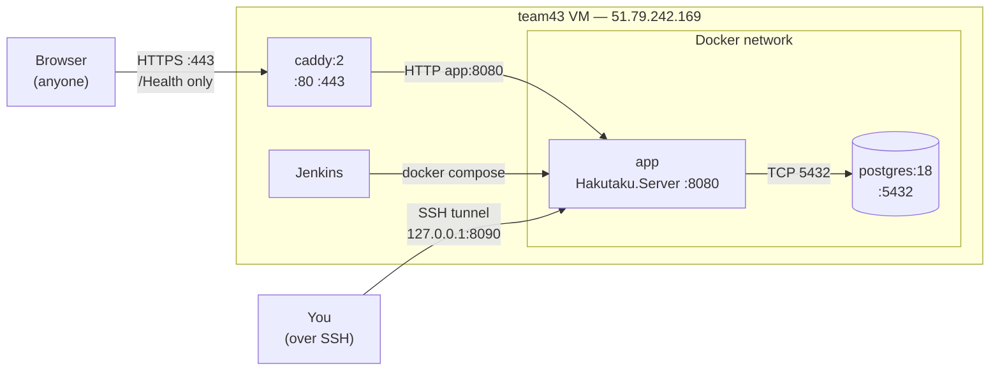
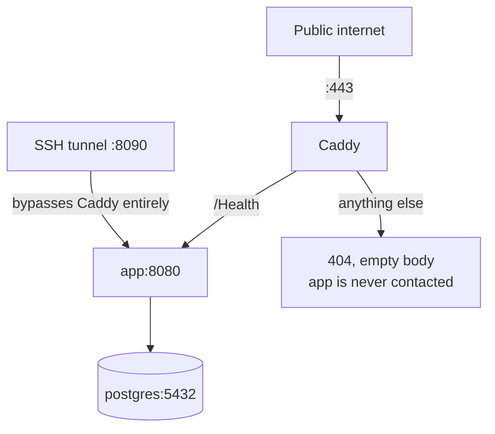
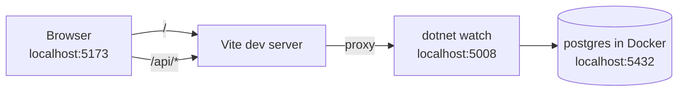

# How the pieces talk

Four processes, three of them containers, and exactly one of them is reachable
from the internet. This page traces what talks to what, in production and in
dev.

## Production topology



The important asymmetry: **Caddy is the only thing listening publicly**, and it
forwards almost nothing. The app is published on the VM's loopback
(`127.0.0.1:8090`) so an SSH tunnel can reach it, and Postgres has no `ports:`
entry at all, so nothing outside the Docker network can see it.

## The three doors

| Door | How you get in | What it reaches | Who can use it |
|---|---|---|---|
| **Public** | `https://51.79.242.169.nip.io` | `/Health` and nothing else | Anyone |
| **Tunnel** | `ssh -L 8090:localhost:8090 team43@...` then `localhost:8090` | The whole app — UI, admin API, everything | Anyone with SSH access to the VM |
| **Internal** | Container-to-container on the Docker network | `app` → `postgres` | The containers themselves |



!!! tip "The tunnel bypasses Caddy, it does not go through it"
    `ssh -L` forwards your local port straight to `127.0.0.1:8090` **on the
    VM**, which is the app's published port. Caddy is not in that path, which is
    why the default-deny rules do not block you. It also means the tunnel is
    plain HTTP inside an SSH-encrypted channel — fine, because SSH already did
    the encryption.

## Tracing one request

### A UI asset, over the tunnel

```text
localhost:8090/assets/index-abc123.js
  → SSH tunnel → VM 127.0.0.1:8090 → app container :8080
  → no /api route matches
  → UseStaticFiles finds wwwroot/assets/index-abc123.js
  → 200
```

### An authenticated API call

```text
GET /api/admin/admins   (cookie: hakutaku_admin_session=…)
  → route matches
  → RequireOwner → FindActiveSession
      → SHA-256 the cookie value, look up admin_sessions by token_hash
      → reject if revoked, past expires_at, or past idle_expires_at
      → load the admin, reject if disabled_at is set
      → push idle_expires_at forward  (one UPDATE)
  → role must be Owner, else 403
  → query admin_users
  → 200 JSON
```

Every authenticated request does that session lookup, and every one of them
writes the idle expiry forward. That single fact has a consequence the frontend
has to respect — see the warning in [Web UI](../components/web.md).

### A path nobody has published

```text
GET https://51.79.242.169.nip.io/login
  → Caddy: no handle block matches /login
  → the catch-all `handle { respond 404 }` answers
  → 404, zero-length body, app never contacted
```

An empty body is the signal that **Caddy** answered rather than the app. If you
ever see a 404 *with* JSON in it, the request reached ASP.NET.

## Login, end to end

```mermaid
sequenceDiagram
    participant B as Browser
    participant A as Hakutaku.Server
    participant D as Postgres

    B->>A: POST /api/admin/login {username, password}
    A->>D: SELECT … WHERE lower(username) = $1
    D-->>A: admin row, or nothing
    Note over A: Argon2.Verify against the row's hash,<br/>or DummyHash if there was no row,<br/>so both cost the same time
    A->>A: token = 32 random bytes
    A->>D: INSERT admin_sessions (token_hash = SHA256(token), ip, expiries)
    A-->>B: 204 + Set-Cookie: hakutaku_admin_session (HttpOnly, SameSite=Strict)

    B->>A: GET /api/admin/me (browser attaches the cookie)
    A->>D: find session by SHA256(cookie); push idle_expires_at
    A-->>B: 200 {username, email, role}
```

The raw token exists in two places only: the browser's cookie jar, and that one
response. The database stores only its SHA-256, so a database dump does not
hand anyone a working session.

## Dev mode is wired differently



Two differences that matter:

1. **Vite serves the UI, not ASP.NET.** `wwwroot` is empty during dev; the
   built UI only lands there inside the Docker image.
2. **Vite proxies `/api` to `:5008`**, which preserves the single-origin
   property that cookie auth depends on. Without the proxy the browser would
   see two origins, and `SameSite=Strict` would stop sending the cookie.

## Forwarded headers

Behind Caddy, every request would otherwise look like it came *from Caddy*.
That would quietly break two things: the per-IP login rate limit (everyone
shares one bucket) and the `Secure` flag on the session cookie (Caddy speaks
plain HTTP to the app, so `request.IsHttps` would be false).

So `Program.cs` enables `UseForwardedHeaders()` for `X-Forwarded-For` and
`X-Forwarded-Proto`, with the known-proxy lists cleared — meaning it trusts
whatever sent the request.

!!! danger "That trust depends on the network, not on code"
    Clearing `KnownProxies` is only safe because **nothing but Caddy can reach
    the app** in production. If the app's port were ever published to the
    internet, any client could forge `X-Forwarded-For` and defeat the login rate
    limit. This is the main reason `compose.yaml` binds port 8090 to
    `127.0.0.1` instead of `0.0.0.0`.

`UseForwardedHeaders()` also runs **before** `UseRateLimiter()`, so the limiter
partitions on the real client IP rather than Caddy's.

## Who may talk to whom

| From | To | Allowed | How it is enforced |
|---|---|---|---|
| Internet | Caddy `:80`/`:443` | Yes | `ports:` in `compose.yaml` |
| Internet | app `:8090` | **No** | Bound to `127.0.0.1` |
| Internet | Postgres | **No** | No `ports:` entry at all |
| Caddy | app `:8080` | Yes | Docker network DNS (`app:8080`) |
| app | Postgres `:5432` | Yes | Docker network DNS (`postgres:5432`) |
| SSH user on the VM | app `:8090` | Yes | Loopback publish + `ssh -L` |

## Still to come

The planned **C++ telemetry ingestion service** will be a fourth talker. The
open question is whether it POSTs to `/api/events` (one source of truth for
validation) or writes straight to Postgres (faster, duplicates the validation).

Either way it needs something `.RequireAdmin()` cannot give it: a game server
has no business holding an admin session cookie. That means a server-key path
before the C++ work can land. See [Telemetry ingestion](../components/ingestion.md).
