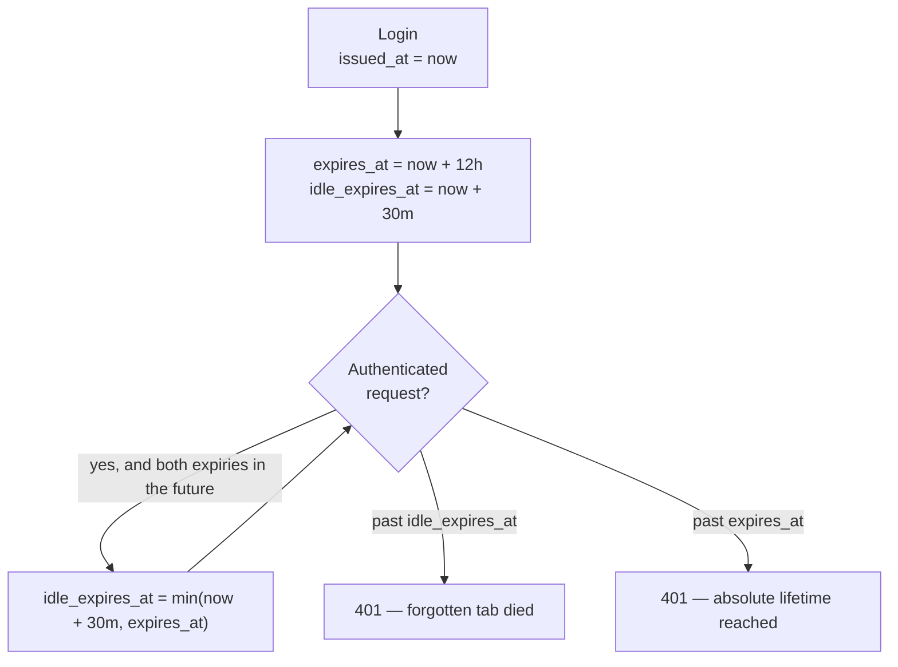

# Auth and sessions

All of it lives in `server/AdminAuth.cs`. This is the most security-sensitive
code in the project and the easiest to break by accident, so this page is
deliberately detailed.

There is **no player-facing auth** — everything here is about admin accounts.

## The shape of it

- Passwords are hashed with **Argon2id**; the encoded hash goes in
  `admin_users.pw_hash`.
- Login mints an **opaque 32-byte random token**. Only its SHA-256 is stored.
- The token goes to the browser as an **`HttpOnly` cookie**, never in a response
  body.
- A session dies at whichever comes first: **30 minutes idle** or **12 hours
  absolute**.
- Two roles, `Owner` and `Admin`, enforced by a database check constraint as
  well as by code.

## Password hashing

```csharp
const int TimeCost = 2;
const int MemoryCostKib = 19456;   // 19 MiB
const int Lanes = 1;
const int HashLength = 32;

public static string HashPassword(string password) =>
    Argon2.Hash(password, TimeCost, MemoryCostKib, Lanes, Argon2Type.HybridAddressing, HashLength);
```

Those are **OWASP's minimum recommended Argon2id parameters**.
`Argon2Type.HybridAddressing` *is* Argon2id — the hybrid of Argon2i and Argon2d,
which is the variant you want for password storage.

`Argon2.Hash` returns an **encoded string** that already contains the salt and
the parameters, which is why there is no separate salt column and why
verification needs nothing but the stored string:

```csharp
static bool VerifyPassword(string encodedHash, string password) =>
    Argon2.Verify(encodedHash, password);
```

!!! tip "Raising the cost later is safe"
    Because the parameters live inside each hash, you can increase them for new
    passwords and old hashes keep verifying with their original settings.

### The timing defence

```csharp
static readonly string DummyHash = HashPassword("dummy-password-for-timing");
```

If the username does not exist, login still runs a full verification — against
that dummy hash:

```csharp
var passwordOk = VerifyPassword(admin?.PwHash ?? DummyHash, request.Password);
if (admin is null || admin.DisabledAt is not null || !passwordOk)
    return Results.Json(new { error = "invalid credentials" }, statusCode: 401);
```

Two properties fall out, and both are deliberate:

1. **Constant-ish timing.** An unknown username costs the same ~tens of
   milliseconds as a wrong password, so response time does not reveal which
   usernames exist.
2. **One identical error.** Wrong password, unknown username and disabled
   account all return the same `401 {"error":"invalid credentials"}`.

!!! danger "Do not 'improve' this with an early return"
    Returning as soon as the user lookup misses would reintroduce the timing
    leak, and splitting the error messages into "no such user" / "wrong
    password" would hand over a username oracle. The combined condition is the
    point.

## Tokens and the cookie

```csharp
var token = Base64Url.EncodeToString(RandomNumberGenerator.GetBytes(32));
```

32 bytes from a CSPRNG. The token carries **no information** — it is a lookup
key, not a JWT. Nothing is encoded in it, so nothing can be forged out of it.

Only the hash is persisted:

```csharp
static byte[] HashToken(string token) =>
    SHA256.HashData(Encoding.UTF8.GetBytes(token));
```

!!! question "Why SHA-256 here, but Argon2id for passwords?"
    Different threat. Passwords are low-entropy and human-chosen, so they need a
    *slow* hash to make guessing expensive. A 32-byte random token has 256 bits
    of entropy — brute force is already impossible, so a fast hash is fine and
    desirable, since this runs on every authenticated request.

The cookie:

```csharp
static CookieOptions SessionCookieOptions(HttpRequest request, DateTime expires) => new()
{
    HttpOnly = true,
    Secure = request.IsHttps,
    SameSite = SameSiteMode.Strict,
    Expires = expires,
    Path = "/",
};
```

| Flag | Effect |
|---|---|
| `HttpOnly` | JavaScript cannot read it, so XSS cannot steal the session |
| `SameSite=Strict` | Never sent on cross-site requests — this is the CSRF defence |
| `Secure = request.IsHttps` | HTTPS-only in production; still works over plain HTTP locally and inside the SSH tunnel |
| `Expires` | Matches the session's absolute expiry |

`Secure` is conditional rather than always-on so local dev and the tunnel both
work. Inside the tunnel the hop is plain HTTP, which is fine — SSH already
encrypted it.

!!! warning "`SameSite=Strict` constrains the whole architecture"
    It is why the UI must be served from the same origin as the API. Put the UI
    on a different host and the browser stops sending the cookie, so login
    breaks with no error that points at the cause. This is the reason the
    `Dockerfile` bakes the Vue build into `wwwroot` and the reason Vite proxies
    `/api` in dev.

## The two expiries

```csharp
const int AbsoluteHours = 12;
const int IdleMinutes = 30;
```



| | Pushed forward? | Guards against |
|---|---|---|
| `idle_expires_at` (30 min) | Yes, on every authenticated request | A forgotten tab staying logged in |
| `expires_at` (12 h) | **Never** | A stolen cookie being kept alive indefinitely |

The push is capped so idle can never outlive absolute:

```csharp
var nextIdle = now.AddMinutes(IdleMinutes);
session.IdleExpiresAt = nextIdle < session.ExpiresAt ? nextIdle : session.ExpiresAt;
```

!!! danger "Never poll `/api/admin/me` on a timer"
    `/me` is an authenticated request, so it pushes the idle expiry forward like
    any other. A 30-second keep-alive means the 30-minute idle timeout **can
    never fire**, leaving only the 12-hour cap — you would have silently deleted
    half the session policy.

    Call `/me` on app load and on route changes. The frontend does exactly that,
    with a comment saying why.

## `FindActiveSession`

The function every authenticated request goes through:

```csharp
public static async Task<(AdminSession Session, AdminUser Admin)?> FindActiveSession(Db db, HttpContext http)
{
    if (!http.Request.Cookies.TryGetValue(CookieName, out var token) || string.IsNullOrEmpty(token))
        return null;

    var tokenHash = HashToken(token);
    var now = DateTime.UtcNow;
    var session = await db.AdminSessions.FirstOrDefaultAsync(s =>
        s.TokenHash == tokenHash
        && s.RevokedAt == null
        && s.ExpiresAt > now
        && s.IdleExpiresAt > now);
    if (session is null) return null;

    var admin = await db.AdminUsers.FindAsync(session.AdminId);
    if (admin is null || admin.DisabledAt is not null) return null;

    var nextIdle = now.AddMinutes(IdleMinutes);
    session.IdleExpiresAt = nextIdle < session.ExpiresAt ? nextIdle : session.ExpiresAt;
    await db.SaveChangesAsync();

    return (session, admin);
}
```

Four rejection reasons, all collapsing to the same `null`: no cookie, no
matching session, revoked or expired, or the admin is disabled.

That last check is what makes deactivation take effect. **Setting
`disabled_at` alone is enough to lock someone out** on their very next request —
revoking their sessions is defence in depth, not the mechanism.

!!! note "It writes on every request"
    One `UPDATE` per authenticated call, to push the idle expiry. Fine at this
    scale. If it ever matters, only push when the stored value is more than a
    minute stale.

## The two guards

### `.RequireAdmin()` — owner or admin

A chainable endpoint filter, used like the framework's own extensions:

```csharp
app.MapGet("/api/players", async (Db db) => await db.Players.ToListAsync())
   .RequireAdmin();
```

```csharp
public static TBuilder RequireAdmin<TBuilder>(this TBuilder builder) where TBuilder : IEndpointConventionBuilder
{
    builder.AddEndpointFilter(async (context, next) =>
    {
        var db = context.HttpContext.RequestServices.GetRequiredService<Db>();
        var found = await FindActiveSession(db, context.HttpContext);
        if (found is null)
            return Results.Json(new { error = "not logged in" }, statusCode: 401);
        return await next(context);
    });
    return builder;
}
```

### `RequireOwner(db, http)` — owner only

Called **inside** a handler, because it needs to distinguish `401` from `403`:

```csharp
var (owner, error) = await RequireOwner(db, http);
if (error is not null) return error;
```

It returns `(AdminUser? Owner, IResult? Error)` — `401 {"error":"not logged
in"}` with no session, `403 {"error":"owner only"}` for a non-owner admin.

| Guard | Lets through | Used by |
|---|---|---|
| `.RequireAdmin()` | Owner **or** admin | `/api/players`, `/api/characters`, `/api/events` |
| `RequireOwner(...)` | Owner only | all of `/api/admin/admins` |

## Roles and the owner

```csharp
public enum AdminRole : short { Owner = 0, Admin = 1 }
```

Enforced in the database too, via `ck_admin_users_role` (`role IN (0, 1)`), so a
third role needs a migration — not just an enum edit. `RoleName()` maps them to
the strings `"owner"` and `"admin"` that the API emits.

### Seeding

```csharp
public static async Task SeedOwner(Db db, IConfiguration config, ILogger logger)
{
    if (await db.AdminUsers.AnyAsync()) return;
    // ... create username "admin" with Role = Owner
}
```

- Runs on **every** startup, but returns immediately unless `admin_users` is
  completely empty.
- Password from `HAKUTAKU_ADMIN_PASSWORD`, else generated and logged **once** as
  a warning.
- There is exactly one owner, and the create endpoint cannot make another —
  `POST /api/admin/admins` always sets `Role = Admin`.

!!! danger "Why the owner cannot be deactivated"
    `DELETE /api/admin/admins/{id}` returns `403` for the owner, whoever is
    asking. That guard is load-bearing: the seeder only runs when there are
    **zero** admins, and login rejects disabled accounts. Disable the sole
    owner and there is no HTTP path back in — recovery would mean direct `psql`
    access to the VM.

## The endpoints

| Method | Path | Guard | Returns |
|---|---|---|---|
| POST | `/api/admin/login` | None, rate-limited 5/min/IP | `204` + `Set-Cookie` |
| POST | `/api/admin/logout` | Needs a session | `204`, clears the cookie |
| GET | `/api/admin/me` | Needs a session | `200 {username, email, role}` |
| GET | `/api/admin/admins` | Owner | `200` array, including deactivated |
| POST | `/api/admin/admins` | Owner | `200 {id, username, role}` |
| DELETE | `/api/admin/admins/{id}` | Owner | `204` |

Full request/response detail in the [API reference](../reference/api.md).

Behaviours worth knowing:

- **Login returns `204` with no body.** Calling `res.json()` on it throws.
- **Logout returns `401` when not logged in.** Treat that as "already logged
  out", not an error — the frontend does.
- **`/me` is how a client discovers whether it is signed in**, since the cookie
  is unreadable from JS.
- **Usernames are matched case-insensitively** and trimmed on login.
- **Creating a duplicate username returns `409`**, caught from Postgres error
  `23505` on the unique index.

### Deactivation

```csharp
var now = DateTime.UtcNow;
target.DisabledAt = now;
await db.AdminSessions
    .Where(s => s.AdminId == target.Id && s.RevokedAt == null)
    .ExecuteUpdateAsync(s => s.SetProperty(x => x.RevokedAt, now));
await db.SaveChangesAsync();
```

One-way. No restore endpoint, because nobody needed one.

!!! warning "It burns the username permanently"
    The unique index on `lower(username)` covers disabled rows, so that username
    can never be used again. The admin UI says so in its confirmation prompt.

## Things not to do

| Do not | Because |
|---|---|
| Poll `/me` on a timer | It defeats the idle timeout entirely |
| Try to read the cookie from JS | `HttpOnly`; call `/me` instead |
| Serve the UI from a different origin | `SameSite=Strict` stops sending the cookie |
| Add an early return when the username misses | Reintroduces the timing leak |
| Split the login error into distinct messages | Creates a username oracle |
| Return an entity directly from an admin endpoint | `pw_hash` would be serialised — project explicitly |
| Publish the app's port on `0.0.0.0` | Forwarded headers are trusted, so the rate limit becomes forgeable |

## Known gaps

- **No audit log.** `admin_sessions` is login history, not an audit trail.
- **`ip` is recorded, never checked.** No session-pinning to an address.
- **`totp_secret` is unused.** The column exists; no code reads it.
- **Deactivation is not atomic.** Sessions are revoked, then the disable is
  saved — two round trips, no transaction.
- **Re-deactivating overwrites `disabled_at`**, losing the original time.
- **No `disabled_by`.** Who deactivated whom is not recorded.
- **No password change endpoint**, and no minimum on *login* length (creation
  requires 8–256).
- **Bearer equivalence.** Anyone holding the cookie is the admin. There is no
  second factor, which is what `totp_secret` was reserved for.
