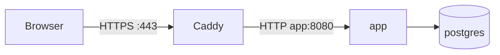
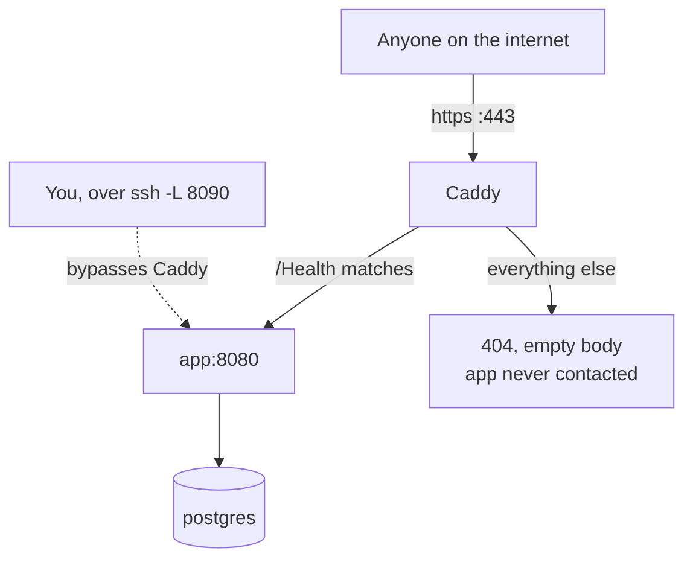

# Caddy

Caddy is the reverse proxy sitting in front of the API. In production it is the
**only** process listening on the public internet, and it forwards almost
nothing — which makes it the single most important file in the repo for
understanding what is and is not exposed.

Config lives in `caddy/Caddyfile`. Both compose files mount it.

## What a reverse proxy does here

A browser talks to Caddy; Caddy decides whether to forward the request to the
app and passes the response back.



Two things are bought with that hop:

1. **The app is never directly exposed.** It only ever listens on the Docker
   network and the VM's loopback.
2. **HTTPS is Caddy's problem.** It obtains and renews Let's Encrypt
   certificates on its own, so the app never has to know TLS exists — it speaks
   plain HTTP internally.

## The whole config

```caddyfile
{$HAKUTAKU_DOMAIN} {

	# Default-deny: only what's named here is public. The admin UI and the rest
	# of /api live behind the SSH tunnel (see the readme), which bypasses Caddy
	# entirely. Add a handle block per public route as more of them land.
	handle /Health {
		reverse_proxy app:8080
	}

	# The public player-auth routes (server/PlayerAuth.cs). register and login are
	# unauthenticated and rate-limited on the app side; link/email needs a player
	# session token. Everything else under /api stays tunnel-only until the rest
	# of the player API exists (see TODO.md item 2).
	handle /api/players/register {
		reverse_proxy app:8080
	}
	handle /api/players/login {
		reverse_proxy app:8080
	}
	handle /api/players/link/email {
		reverse_proxy app:8080
	}
	# Sets the player's display name; needs a player session token.
	handle /api/players/display-name {
		reverse_proxy app:8080
	}
	# Email verification and password reset. verify and resend need a player token;
	# forgot and reset are unauthenticated. All four share one rate limit per IP.
	handle /api/players/email/verify {
		reverse_proxy app:8080
	}
	handle /api/players/email/resend {
		reverse_proxy app:8080
	}
	handle /api/players/password/forgot {
		reverse_proxy app:8080
	}
	handle /api/players/password/reset {
		reverse_proxy app:8080
	}

	handle {
		respond 404
	}
}

# The wiki (docs/), served by the `docs` container. A separate site rather than
# a /docs path on the main domain: a subpath needs site_url set and breaks
# mkdocs' live-reload websocket. Caddy issues this its own certificate, which
# draws on a separate Let's Encrypt rate-limit bucket from the main domain.
# This is deliberately public -- it is the team's onboarding wiki.
{$HAKUTAKU_DOCS_DOMAIN} {
	reverse_proxy docs:5020
}
```

That is the entire public surface of the project: **`/Health` and the eight
player-auth routes on the main domain, plus the wiki on its own subdomain**.
Each `handle` matches one exact path, so a route that is not listed gets the
`404` catch-all even if the app has it.

### Reading it line by line

**`{$HAKUTAKU_DOMAIN}`** — the site address, from an environment variable.

!!! warning "Caddy's syntax is the reverse of Compose's"
    Caddy uses `{$VAR}`. Docker Compose uses `${VAR}`. The brace and dollar are
    swapped, they appear in the same stack, and Caddy treats a wrong one as a
    **literal hostname** rather than erroring. If Caddy is serving a site called
    `${HAKUTAKU_DOMAIN}`, this is why.

The two compose files feed it different values, which is the entire difference
between dev and production TLS:

| File | Value | Result |
|---|---|---|
| `compose.yaml` | `51.79.242.169.nip.io` | A real domain, so automatic HTTPS kicks in |
| `compose.dev.yaml` | `:80` | Plain HTTP, any hostname, no certificate |

A bare `:80` can **never** get HTTPS, because Let's Encrypt only issues
certificates for domain names — not for ports, `localhost`, or bare IPs.

**`handle /Health { reverse_proxy app:8080 }`** — the first public route. The
player-auth `handle` blocks have the same shape.
`app:8080` is Docker network DNS: `app` is the service name in the compose file,
`8080` the port the container listens on.

**`handle { respond 404 }`** — the catch-all. No matcher means it matches
everything.

### The docs subdomain

The second site block serves this wiki from the `docs` container:

```caddyfile
{$HAKUTAKU_DOCS_DOMAIN} {
	reverse_proxy docs:5020
}
```

It is a **separate site**, not a `/docs` path on the main domain, and that is
worth understanding:

| | |
|---|---|
| A subpath would need `site_url` set | MkDocs generates absolute asset links without it |
| A subpath breaks live reload | The dev server's websocket does not survive prefix stripping |
| A separate site gets its own certificate | Which draws on its own Let's Encrypt rate-limit bucket |
| No new port is opened | It rides `:443`, already public |

The hostname is derived in `compose.yaml` rather than stored in `.env`:

```yaml
HAKUTAKU_DOCS_DOMAIN: docs.${HAKUTAKU_DOMAIN}
```

[nip.io](https://nip.io) resolves **any** prefix to the embedded IP, so
`docs.51.79.242.169.nip.io` already points at the VM with no DNS record to
create. Nothing on the VM's `.env` needs changing.

!!! info "This one is public on purpose"
    Unlike everything else outside `/Health`, the wiki is meant to be readable
    by the team without a tunnel. It does describe the system's internals, so if
    that stops being acceptable, the smallest fix is Caddy `basic_auth` on this
    block — it does not require touching anything else.

Locally the same block is reached over plain HTTP, because `compose.dev.yaml`
sets `HAKUTAKU_DOCS_DOMAIN: ":5020"` and publishes that port. A bare port can
never get a certificate, which is the same reason the main site is `:80` in dev.

### Why `handle` and not `respond` on its own

`handle` blocks are **mutually exclusive**: Caddy picks exactly one, the most
specific matcher that fits, and ignores the rest. That is what makes this a real
default-deny.

The alternative — a bare `respond 404` plus a named matcher — would depend on
Caddy's default directive ordering, which is a much easier thing to get subtly
wrong.

## The three ways in



The dotted line is the one that surprises people. `ssh -L` forwards your local
port to `127.0.0.1:8090` **on the VM**, and that is the app's published port.
Caddy is not in the path at all, so its rules do not apply. That is precisely
why the admin UI stays reachable for the team while being invisible publicly.

## Telling Caddy's 404 from the app's

This is the fastest diagnostic in the project:

```bash
curl -si https://51.79.242.169.nip.io/login | head -5
```

| What you see | Who answered |
|---|---|
| `404`, `Content-Length: 0`, no content type | **Caddy** — default-deny worked |
| `404` with a JSON body | **The app** — the request got through Caddy |
| `200` + HTML | The UI is public, which it should not be |
| `502` | Caddy is up, the app is not |

An empty body is the win condition. It proves the app was never contacted.

## Adding a public route

Add a `handle` block above the catch-all:

```caddyfile
handle /api/player* {
    reverse_proxy app:8080
}
```

Then, before you commit:

1. **Is it meant to be public?** Anything under `/api/admin` is not.
2. **Does it have its own auth?** Caddy forwards; it does not authenticate.
   `.RequireAdmin()` is not the right gate for a game server.
3. **Did you keep the catch-all last?** It must stay the least specific block.

Caddy sorts `handle` blocks by matcher specificity rather than by file order, so
the catch-all cannot accidentally shadow a real route — but keeping it last
makes the file readable.

## Automatic HTTPS

Once the site address is a real domain, Caddy handles certificates with no extra
config. There is no redirect directive to write: it issues the certificate
*and* installs the HTTP→HTTPS redirect on port 80 for you.

Which is why `:80` must stay published even though everything is HTTPS:

- Let's Encrypt validates the domain by fetching
  `http://<domain>/.well-known/acme-challenge/<random>` over port 80.
- The HTTP→HTTPS redirect lives there too.

The domain's DNS must already resolve to the host *before* Caddy starts, or the
challenge fails. The project sidesteps DNS registration entirely by using
[nip.io](https://nip.io): `51.79.242.169.nip.io` resolves to `51.79.242.169`
automatically.

!!! danger "Protect the `caddy_data` volume"
    Caddy stores issued certificates **and** the Let's Encrypt account key in
    `/data`. Without the volume, every container recreation re-requests
    certificates from scratch — and Let's Encrypt allows only **5 duplicate
    certificates per week** per domain. Burn through that and the site has no
    valid certificate until the window resets.

    Concretely: avoid repeated `docker compose down -v` against the real domain.
    `down -v` removes volumes.

### Testing certificate changes safely

Point Caddy at Let's Encrypt's staging CA, which has far looser limits, by
adding a global block at the very top of the Caddyfile:

```caddyfile
{
	acme_ca https://acme-staging-v02.api.letsencrypt.org/directory
}
```

Staging certificates are not trusted by browsers, so you get a warning page —
that is expected, and it proves DNS, ports and the challenge all work. Delete
the block to get a real certificate.

## The Caddyfile is mounted as a directory

In both compose files:

```yaml
volumes:
  - ./caddy:/etc/caddy:ro
```

Note it mounts `./caddy`, the **directory**, not `./caddy/Caddyfile`.

!!! bug "This cost real debugging time — do not change it back"
    A single-file bind mount pins the file's **inode**. Git does not edit files
    in place, it replaces them, which creates a *new* inode. So after a
    `git pull` the container kept serving the **old** Caddyfile, with no error
    and no warning, while the file on disk was clearly correct.

    Mounting the directory means the container resolves the path fresh and sees
    the real file. It is also what makes `caddy reload` actually work — with the
    file mount, reload re-read the stale file and did nothing.

## Applying a config change

Compose does not restart Caddy when only the Caddyfile's *contents* change, and
Caddy does not watch the file. The Jenkins pipeline reloads it explicitly after
every deploy:

```bash
docker compose -p hakutaku --env-file /var/lib/jenkins/hakutaku.env \
  -f compose.yaml exec -T caddy caddy reload --config /etc/caddy/Caddyfile
```

`reload` validates the new config first and keeps the running one if it is
invalid — so a syntax error fails the build rather than taking the site down.

Validate locally before pushing:

```bash
docker run --rm -v "${PWD}/caddy:/etc/caddy:ro" caddy:2 \
  caddy validate --config /etc/caddy/Caddyfile
```

## Troubleshooting

??? failure "I deployed a Caddyfile change and the site behaves as before"
    Check the config the container actually has, not the one in your repo:

    ```bash
    docker compose -p hakutaku -f compose.yaml exec caddy cat /etc/caddy/Caddyfile
    ```

    If it is stale, the mount is wrong (see above) or the deploy did not run.
    If it is correct but behaviour has not changed, you are probably looking at
    a **cached page** — `curl` has no cache, so test with that, not a browser.

??? failure "The UI still loads publicly after a default-deny change"
    Almost always browser cache. The admin UI is a history-mode single-page app:
    once `index.html` and the JS bundle are cached, the router renders `/login`
    **entirely in the browser** with no server request at all.

    ```bash
    curl -si https://51.79.242.169.nip.io/login | head -3
    ```

    `404` with an empty body means the server is correct. Hard-reload
    (`Ctrl+Shift+R`) or use a private window.

??? failure "502 Bad Gateway"
    Caddy is running, the app is not reachable. Right after `up` this is normal
    for a second or two. Otherwise:

    ```bash
    docker compose -p hakutaku -f compose.yaml ps
    docker compose -p hakutaku -f compose.yaml logs app
    ```

??? failure "No certificate / TLS errors"
    ```bash
    docker compose -p hakutaku -f compose.yaml logs caddy
    ```

    Check in order: does the domain resolve to this host, is `:80` published and
    open in the firewall, and have you hit the 5-per-week duplicate limit?

??? failure "Caddy is serving a site literally named `${HAKUTAKU_DOMAIN}`"
    Wrong brace syntax. Caddy needs `{$HAKUTAKU_DOMAIN}`.
