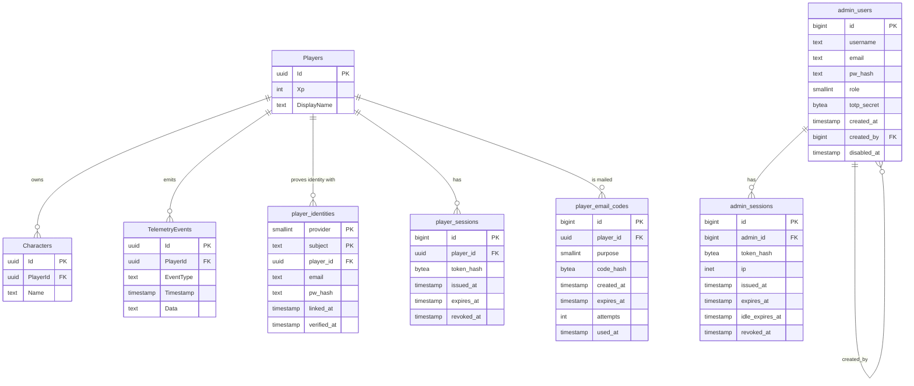

# Database

PostgreSQL 18, reached through EF Core 10 with the Npgsql provider. The schema
lives in version control as C# migrations, and the app applies them on startup.

## The schema



## Two naming conventions, on purpose

| | Game data | Admin and player-auth data |
|---|---|---|
| Tables | `Players`, `Characters`, `TelemetryEvents` | `admin_users`, `admin_sessions`, `player_identities`, `player_sessions`, `player_email_codes` |
| Naming | PascalCase (EF's default) | snake_case (configured explicitly) |
| Primary key | `uuid`, generated client-side | `bigint` identity, or a composite key for `player_identities` |
| Defined in | `server/Models/data.cs` | `server/Models/Admin.cs`, `server/Models/PlayerIdentity.cs` + `OnModelCreating` |

The admin and player-auth tables follow the project's documented conventions.
The game tables predate them and still use EF defaults. (`player_id` columns are
`uuid` because they point at `Players.Id`.)

!!! warning "New tables should follow the admin style"
    snake_case names, `bigint` identity keys. The game tables are the exception,
    not the pattern.

## Entities

### Game data

`server/Models/data.cs` — three plain classes, no base class, no annotations:

```csharp
public class Player
{
    public Guid Id { get; set; }
    public int Xp { get; set; }
    public string? DisplayName { get; set; }
}
```

`Player` holds no login details. How a player proves who they are lives in
`player_identities` (below). `DisplayName` is only what the game shows: it is
nullable, deliberately **not unique** (no index), and limited to 3–25 characters
by the app, not by the column.

- A `Character` belongs to a `Player` and carries no progression of its own yet
  — it is currently just identity.
- A `TelemetryEvent` is **player-scoped, not character-scoped**. `Data` holds
  the event payload as JSON *text*, and `Timestamp` is always set server-side in
  UTC.

!!! note "`Data` is `text`, not `jsonb`"
    So Postgres does not validate or index the payload. Querying inside it means
    casting. Fine while nothing queries it; a change to make when something does.

### Player auth data

`server/Models/PlayerIdentity.cs`. A player can have several **identities**; each
is one way to prove who they are.

| `provider` | Meaning | `subject` |
|---|---|---|
| `0` device | The game's device UUID | the UUID |
| `1` email | Email + password | the lowercased email |
| `2` steam | Reserved, nothing creates it yet | — |

- **`(provider, subject)` is the primary key.** One device or email can belong to
  at most one player, and it is what makes find-or-create safe when two requests
  for a new device arrive together: the second insert fails instead of making a
  duplicate player.
- Postgres also enforces **at most one email identity per player** (the partial
  unique index `ux_player_identities_one_email`) and the provider range
  (`ck_player_identities_provider`).
- **`email`** repeats the address on email identities, kept apart from `subject`
  because it is PII. **`pw_hash`** is the Argon2id encoded string, email only.
- Linking an email **adds** a row; the device identity stays, so the device keeps
  working.
- **`verified_at`** is null until the player enters the mailed code. Only a
  verified email can reset its password. Device identities never use it.
- **`player_email_codes`** holds the codes mailed for verification (`purpose` 0)
  and password reset (`1`). Only a hash of the code is stored, with a 15 minute
  expiry, an attempt counter and a `used_at`.
- **`player_sessions.token_hash`** is the SHA-256 of the session token, like the
  admin side. Sessions have one fixed expiry (30 days) and no idle timeout. Old
  rows are never cleaned up.
- Deleting a player cascades to its identities and sessions.

### Admin data

`server/Models/Admin.cs`:

```csharp
public enum AdminRole : short
{
    Owner = 0,
    Admin = 1,
}
```

Two roles, and **Postgres enforces it** — not just the C# enum:

```csharp
e.ToTable("admin_users", t => t.HasCheckConstraint("ck_admin_users_role", "role IN (0, 1)"));
```

Adding a third role is therefore a migration, not just an enum edit. The
database will reject the insert otherwise.

Column notes:

- **`username`** is the login identifier, unique case-insensitively.
- **`email`** is optional, unused for login, and reserved for future report
  hooks. Do not add format validation: the seeded owner's value is not an email
  address.
- **`pw_hash`** is the full Argon2id *encoded string* — salt and parameters are
  inside it, so there is no separate salt column.
- **`totp_secret`** exists and is **read by nothing**. Dead for now.
- **`disabled_at`** is the soft-delete marker. Nothing is hard-deleted.
- **`token_hash`** on a session is the SHA-256 of the token. The raw token is
  never stored.
- **`ip`** is recorded at login and **never compared** against anything.

## Indexes and constraints

| Object | On | Why |
|---|---|---|
| `ux_admin_users_username_lower` | `lower(username)` | Case-insensitive unique login. Raw SQL, because EF cannot express a functional index. |
| Unique index | `admin_sessions.token_hash` | One session per token, and makes lookup an index hit |
| `ck_admin_users_role` | `role IN (0, 1)` | The role enum, enforced in the database |
| FK, `ON DELETE CASCADE` | `admin_sessions.admin_id` | Deleting an admin row removes its sessions |
| FK, `NO ACTION` | `admin_users.created_by` | Self-reference; must not cascade admins into each other |

The login query is written so it uses that functional index:

```csharp
var admin = await db.AdminUsers.FirstOrDefaultAsync(a => a.Username.ToLower() == username);
```

`.ToLower()` translates to `lower(username) = $1`, which matches the indexed
expression. Writing it any other way silently drops to a sequential scan.

!!! warning "The unique index covers disabled rows"
    A deactivated admin's username can **never** be reused — there is no partial
    `WHERE disabled_at IS NULL`. That is a deliberate consequence of soft
    delete, surfaced in the UI's confirmation prompt.

## Migrations

### They apply themselves

`Program.cs`, before the app serves anything:

```csharp
using (var scope = app.Services.CreateScope())
{
    var db = scope.ServiceProvider.GetRequiredService<server.Models.Db>();
    db.Database.Migrate();
    await server.AdminAuth.SeedOwner(db, app.Configuration, app.Logger);
}
```

So nobody runs `dotnet ef database update` as part of normal work. Start the
app and the schema is current.

!!! note "This does not survive scaling out"
    Several app instances against one database would race to apply migrations on
    boot. Correct for one instance; a real problem the day a second appears.

### History

| Migration | What it did |
|---|---|
| `20260916031439_InitialCreate` | `Players` |
| `20260918051412_AddCharacterAndTelemetry` | `Characters`, `TelemetryEvents` |
| `20260925095216_AddAdminTables` | `admin_users`, `admin_sessions`, the role check, the lower-email index |
| `20260929061126_AddIdleExpiryToAdminSessions` | `idle_expires_at` |
| `20260930162910_AddUsernameToAdminUsers` | Added `username`, backfilled it from `email`, swapped the functional index |

That last one is worth reading as an example of a non-trivial migration — it
backfills existing rows before swapping the unique index, so the seeded owner's
account keeps working:

```csharp
migrationBuilder.Sql("UPDATE admin_users SET username = email WHERE username = '';");
migrationBuilder.Sql("DROP INDEX ux_admin_users_email_lower;");
migrationBuilder.Sql("CREATE UNIQUE INDEX ux_admin_users_username_lower ON admin_users (lower(username));");
```

### Adding one

```bash
dotnet tool install --global dotnet-ef   # once per machine
cd server
dotnet ef migrations add SomeChange
```

Then, before committing:

1. **Read the generated file.** EF guesses, and sometimes guesses wrong —
   especially around renames, which it may emit as drop-plus-add and lose data.
2. **Check the `Down` method** actually reverses `Up`.
3. **Commit the `.Designer.cs` and the updated `DbModelSnapshot.cs` too.**
   Leaving the snapshot behind makes the next person's migration diff against
   stale state.
4. **Add data-moving SQL by hand** if a column needs backfilling. EF will not
   write that for you.

!!! danger "Never edit an applied migration"
    Once a migration has run anywhere — including a teammate's machine — it is
    history. Fix it forward with a new migration.

### The `idle_expires_at` default

That migration added the column as `NOT NULL DEFAULT '0001-01-01'`. The
year-one value correctly invalidated every pre-existing session, which was the
point. But **the default is still on the column**, so any future insert path
that forgets the field silently creates a session that is already dead. Worth
dropping when someone is next in there.

## Connection strings: two readers

A persistent source of confusion. There are two mechanisms and they do not see
each other:

| Who is running | Reads | Value |
|---|---|---|
| `dotnet watch` on your machine | `server/appsettings.Development.json` | `Host=localhost;Port=5432;…` |
| Anything in Docker | `ConnectionStrings__Db` env var from the compose file | `Host=postgres;…` |

The env var wins when both are present, because environment variables override
`appsettings.*.json` in ASP.NET's configuration order. The hostname is the
tell: `localhost` means the host process, `postgres` means inside the Docker
network.

`.env` is read by **Compose only**. `dotnet watch` never sees it.

## Backups

```bash
# back up (dev)
docker compose -f compose.dev.yaml exec -T postgres \
  pg_dump -U hakutaku hakutaku | gzip > backup-$(date +%F).sql.gz

# restore
gunzip -c backup-2026-09-16.sql.gz | \
  docker compose -f compose.dev.yaml exec -T postgres psql -U hakutaku hakutaku
```

For production, swap in `-p hakutaku -f compose.yaml`.

!!! warning "There is no scheduled backup"
    Nothing runs these automatically. Take one by hand before anything
    schema-shaped in production.

## Known issues

- **Player sessions pile up.** Every register or email login adds a
  `player_sessions` row and nothing deletes expired ones. Same story as
  `admin_sessions`, and as `player_email_codes`.
- **`TelemetryEvent.Data` is `text`**, so payloads are neither validated nor
  indexable without casting.
- **A bad `playerId` returns a bare `500`**, not a clean `4xx` — the foreign-key
  violation is not caught.
- **Npgsql's default pool is 100 connections** and Postgres' default
  `max_connections` is also 100. One app instance is fine; two could exhaust it.
- **IDs will change.** Game entities use GUIDs; planning documents target
  `bigint`. Treat IDs as opaque strings everywhere outside the server.
