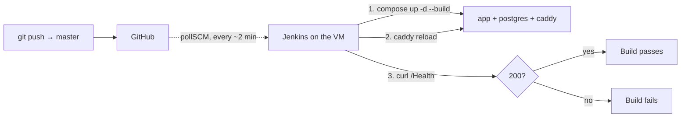
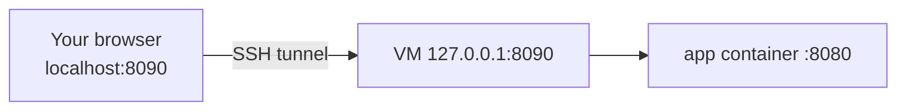

# Deploy and CI/CD

Production runs on the DigiPen **team43** VM, and Jenkins redeploys it on every
merge to `master`. Nobody deploys by hand in the normal case.

## The environment

| | |
|---|---|
| Host | DigiPen team43 VM, `51.79.242.169` |
| Domain | `51.79.242.169.nip.io` — [nip.io](https://nip.io) wildcard DNS, so no registrar |
| Resources | 4 GB RAM, 2 GB swap — also running Jenkins and Postgres |
| Open ports | 22 (SSH), 80 and 443 (Caddy). Nothing else |
| Compose project | `hakutaku` |
| Secrets | `~/.env` on the VM, plus `/var/lib/jenkins/hakutaku.env` for Jenkins |

## The pipeline



Jenkins **polls** every two minutes rather than receiving a webhook, because the
VM is not publicly reachable on a webhook port. So a merge takes up to ~2
minutes to start building.

### `Jenkinsfile`

```groovy
stage('Deploy') {
    steps {
        // -p hakutaku keeps the compose project name the same as the manual deploy,
        // so the existing pgdata and caddy_data volumes are reused, not recreated.
        sh 'docker compose -p hakutaku --env-file /var/lib/jenkins/hakutaku.env -f compose.yaml up -d --build'

        // Compose won't restart caddy when only the Caddyfile's contents change,
        // and caddy doesn't watch the file. reload validates the new config first
        // and keeps the running one if it's invalid, so this fails the build
        // rather than the site.
        sh 'docker compose -p hakutaku --env-file /var/lib/jenkins/hakutaku.env -f compose.yaml exec -T caddy caddy reload --config /etc/caddy/Caddyfile'
    }
}

stage('Smoke test') {
    steps {
        sh 'curl -fsS --retry 15 --retry-delay 4 --retry-connrefused https://51.79.242.169.nip.io/Health'
    }
}
```

Three things in there are load-bearing:

**`-p hakutaku`** — Compose names volumes after the project, and the project
defaults to the directory name. Jenkins checks out into its own workspace, so
without this flag it would build a **second stack with an empty database**
instead of reusing `pgdata` and `caddy_data`.

**`--env-file /var/lib/jenkins/hakutaku.env`** — the Jenkins user cannot read
`/home/team43`, so the secrets are copied to a file it owns (mode `600`).

**`caddy reload`** — Compose only recreates a container when its *service
definition* changes; editing a mounted file's contents is invisible to it, and
Caddy does not watch the file. `reload` validates first and keeps the running
config if the new one is broken, so a syntax error fails the build rather than
taking the site down.

The smoke test retries for about a minute, which covers the app's startup and
migration time.

!!! note "There is no test stage"
    Because there is no test suite. `/Health` returning `200` is the only gate.

## Reaching the admin UI

The app is published on the VM's **loopback only**, so it is not reachable from
the internet. Forward the port over SSH:

```bash
ssh -L 8090:localhost:8090 team43@51.79.242.169
```

Leave that session open and visit **<http://localhost:8090>**.



!!! tip "The middle hostname resolves on the VM"
    In `-L 8090:localhost:8090`, the first port is yours and `localhost:8090` is
    resolved **on the SSH server**. That is why it reaches the VM's loopback and
    not your own machine.

The session cookie is not marked `Secure` over the tunnel, because the hop
inside it is plain HTTP. That is fine — SSH already encrypted everything.

!!! info "This is the only way in"
    `caddy/Caddyfile` is default-deny: `/Health` is public and everything else
    gets a `404`, including the UI. Nothing on the public domain can reach the
    admin API or even tell that an admin panel exists.

### Reaching Jenkins

Same idea, different port — Jenkins holds `8080` on the VM:

```bash
ssh -L 8081:localhost:8080 team43@51.79.242.169
```

Then **<http://localhost:8081>**. (This is also why the app uses host port
**8090**: 8080 was taken.)

### Reaching the wiki

No tunnel needed — the wiki is deliberately public:

**<https://docs.51.79.242.169.nip.io>**

Caddy proxies that subdomain to the `docs` container, which runs `mkdocs serve`
against the repo checked out on the VM. So a merge to `master` updates the wiki
along with everything else.

The hostname needs no DNS record and no `.env` entry: `compose.yaml` derives it
as `docs.${HAKUTAKU_DOMAIN}`, and [nip.io](https://nip.io) resolves any prefix
to the embedded IP.

!!! note "It gets its own certificate"
    A separate site means a separate Let's Encrypt certificate — and therefore a
    separate rate-limit bucket, so certificate trouble on one domain cannot
    affect the other. Expect one extra ACME request the first time this deploys.

## Deploying by hand

Only when Jenkins is broken or you are testing something it does not do:

```bash
ssh team43@51.79.242.169
cd ~/Hakutaku
git pull
docker compose -p hakutaku -f compose.yaml up -d --build
docker compose -p hakutaku -f compose.yaml exec -T caddy caddy reload --config /etc/caddy/Caddyfile
docker compose -p hakutaku -f compose.yaml logs -f caddy
```

!!! danger "Never run `down -v` against production"
    It deletes the volumes: the whole database, **and** `caddy_data` with the
    issued certificates and the ACME account key. Let's Encrypt allows only 5
    duplicate certificates per week per domain, so repeated recreation leaves
    the site with no valid certificate until the window resets.

    `docker compose down` without `-v` is the safe form.

## When a deploy looks like it did nothing

This has happened more than once, and the cause was different each time.
Work down the list in order — each step rules out a layer.

### 1. Did the code actually land?

```bash
git log --oneline -1 origin/master
git status
```

An unpushed commit or a dirty tree is the most common answer.

### 2. Did the build run?

Open Jenkins through the tunnel and check the latest build. Polling means up to
two minutes of delay before it even starts.

### 3. Ask the server, not your browser

```bash
curl -sI https://51.79.242.169.nip.io/login
curl -s -o /dev/null -w '%{http_code} %{size_download}\n' https://51.79.242.169.nip.io/Health
```

`curl` has no cache and no client-side router, so it shows what the server
really does.

| Result | Meaning |
|---|---|
| `404`, `Content-Length: 0` | Caddy answered — default-deny is working |
| `404` with a JSON body | The app answered, so Caddy forwarded it |
| `200` + HTML on a path that should be denied | The deploy did not apply |
| `502` | Caddy is up, the app is not |

### 4. Check the config the container actually has

```bash
docker compose -p hakutaku -f compose.yaml exec caddy cat /etc/caddy/Caddyfile
```

!!! bug "The one that wasted the most time"
    The Caddyfile used to be mounted as a **single file**, which pins the
    inode. Git replaces files rather than editing them, so after a `git pull`
    the container kept serving the **old** config — silently, with the correct
    file sitting on disk. `caddy reload` then re-read the stale file and did
    nothing.

    Fixed by mounting `./caddy` as a directory. If you ever see stale config
    again, check this first.

### 5. It is your browser

If `curl` shows the server is correct and the browser disagrees, the browser is
serving a cached copy.

The admin UI is a **history-mode single-page app**: once `index.html` and the JS
bundle are cached, vue-router renders `/login` entirely client-side with no
server request at all. The page can look completely unchanged while the server
would `404` it.

Fix: hard reload (`Ctrl+Shift+R`), or a private window.

## Rebuilding this setup

Things that will trip you up, collected from doing it once:

- The `jenkins` user must be in the `docker` group, or every `sh 'docker …'`
  step fails on permissions.
- Jenkins cannot read `/home/team43`, hence the `hakutaku.env` copy at
  `/var/lib/jenkins/hakutaku.env`, owned by `jenkins`, mode `600`.
- `-p hakutaku` must stay in every command, or you get a second stack with an
  empty database.
- `.env` is gitignored, so it has to be created on the VM by hand from
  `.env.example`.
- DNS must resolve **before** Caddy first starts, or the ACME challenge fails.
  `nip.io` makes this automatic.
- Docker publishes ports with iptables rules that are evaluated *before* `ufw`,
  so a `ufw deny` does not reliably block a published port. Binding to
  `127.0.0.1` in the compose file is the control that actually works.

## Known gaps

- **No automated backups.** Take a `pg_dump` by hand before anything
  schema-shaped — see [Database](../components/database.md#backups).
- **The wiki runs on a dev server.** `mkdocs serve` is single-threaded and
  meant for local use. It is fine for a handful of readers behind Caddy's TLS;
  it is not a production web server. Swapping to `mkdocs build` plus Caddy's
  `file_server` is the upgrade if it ever matters.
- **No rollback step.** Recovery is a revert commit plus another deploy.
- **Migrations run on app startup**, so a bad migration takes the app down
  rather than failing a deploy stage.
- **No staging environment.** `master` goes straight to production.
- **Only one open item on the pipeline**: confirming that a merge triggers a
  build unattended. Build #2 passed, but it was started with *Build Now*.
