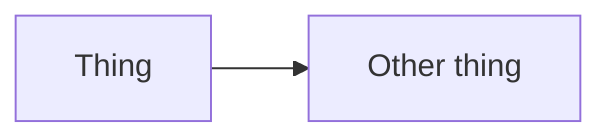

# Contributing

## Branch and PR flow

Work on a branch, open a PR into `master`, merge it.

```bash
git switch -c feature/your-thing
# ...work...
git push -u origin feature/your-thing
```

The repo's history follows `feature/<short-name>` — `feature/admin-username`,
`feature/admin-cookie-auth`, `feature/admin-tables`. Match that.

!!! danger "A merge to `master` deploys to production"
    Jenkins polls `master` every two minutes and redeploys the live stack. There
    is no staging environment and no approval step. `master` *is* production.

Commit subjects are short and imperative, describing the change rather than the
activity:

```text
Add owner-guarded admin creation and deactivation
Switch admin login from email to username
Mount caddy config as a directory so Caddyfile changes deploy
```

## Before you push

```bash
cd server && dotnet build      # must say Build succeeded
cd web && npm run build        # runs vue-tsc first, so type errors fail here
```

There are no tests to run — there is no test suite. That makes those two builds
the only automated check before production, so do not skip them.

If you touched anything Docker-shaped:

```bash
docker compose -f compose.dev.yaml build
```

If you touched the Caddyfile:

```bash
docker run --rm -v "${PWD}/caddy:/etc/caddy:ro" caddy:2 \
  caddy validate --config /etc/caddy/Caddyfile
```

## Migrations

```bash
cd server
dotnet ef migrations add SomeChange
```

Then:

- **Read the generated file.** EF guesses, and gets renames wrong — it may emit
  a drop plus an add, which loses data.
- **Check `Down` actually reverses `Up`.**
- **Commit all three files**: the migration, its `.Designer.cs`, and the updated
  `DbModelSnapshot.cs`. Leaving the snapshot behind makes the next person's
  migration diff against stale state.
- **Write backfill SQL by hand** if a column needs populating. EF will not.

!!! danger "Never edit a migration that has been applied"
    Once it has run anywhere — including a teammate's machine — it is history.
    Fix it forward with a new migration. And remember migrations run on **app
    startup**, so a broken one takes production down rather than failing a
    deploy stage.

## Adding things

| Adding | Read first |
|---|---|
| An API endpoint | [Server](../components/server.md#adding-an-endpoint) |
| A UI page | [Web UI](../components/web.md) — one entry in `router.ts`, nothing in `App.vue`, no new files outside `pages/` |
| A public route | [Caddy](../components/caddy.md#adding-a-public-route) |
| A database table | [Database](../components/database.md) — snake_case, `bigint` keys |

Two rules that are easy to get wrong:

- **Nothing is public unless `caddy/Caddyfile` says so.** A new endpoint is
  tunnel-only until someone adds a `handle` block, and that is the desired
  default.
- **Never map `/` to an endpoint.** It shadows the entire Vue UI.

## Code style

Match the surrounding code. Specifically:

### Comments explain *why*, not *what*

```csharp
// Materialised before projecting so RoleName stays reusable -- EF can't
// translate a local method into SQL. The table is tiny, so this is fine.
var admins = await db.AdminUsers.OrderBy(a => a.Id).ToListAsync();
```

That comment is load-bearing: the next reader's instinct is to "optimise" it
back into a single SQL projection, which does not compile. A comment that
restates the code is noise; one that stops a plausible wrong edit is worth
keeping.

### Keep validation on the server

The UI mirrors the server's rules so forms behave sensibly. It is never the
enforcement point. Anything a browser checks must also be checked by a handler.

### Project, do not serialise

Return an explicit shape from admin endpoints rather than the entity. That is
what keeps `pw_hash` out of a response.

## Line endings

`core.autocrlf` is `true` on at least one machine here, and some files are
committed with CRLF while others are LF. The practical effect is that a
whitespace-only change can inflate a diff to hundreds of lines.

Reviewing one:

```bash
git diff -w                      # ignore whitespace
```

On GitHub, append `?w=1` to a diff URL.

The durable fix — a `.gitattributes` with `* text=auto` plus
`git add --renormalize .` — has not been done. Worth doing in a commit of its
own, since it touches every file.

## Documentation

This wiki lives in `docs/`, with navigation in `mkdocs.yml`.

```bash
mkdocs serve    # http://localhost:5020, live reload
```

Or without installing Python:

```bash
docker run --rm -p 5020:5020 -v "${PWD}:/docs" \
  squidfunk/mkdocs-material serve --dev-addr 0.0.0.0:5020
```

Adding a page means creating the `.md` file **and** adding it to the `nav:` in
`mkdocs.yml` — otherwise it will not appear in the sidebar.

### Keep it honest

The docs are structured so that each fact has one home:

| Doc | Holds |
|---|---|
| `docs/` | How things work, for humans |
| `TODO.md` | The roadmap — what is done, what is next, why |
| `CLAUDE.md` | A dense architecture brief for Claude Code |
| `readme.md` | A short front door pointing here |

Please do not copy content between them. If the docs and the code disagree, the
code wins — fix the page in the same PR.

!!! tip "Write the gaps down"
    Several pages end with a "Known gaps" section listing what is missing,
    broken or dead. That is deliberate: a reader who knows `totp_secret` is
    unused will not go looking for the code that reads it. When you find
    something like that, add it.

### Style

The pages are written to be read, not studied:

- Short sections with real headings.
- Tables wherever a list has a shape.
- Admonitions for the things that actually bite — `!!! warning` for a trap,
  `!!! danger` for something destructive, `??? failure` for a collapsible
  troubleshooting entry.
- Mermaid fences for diagrams, so they stay diffable:

````markdown

````

## Review

Anything in these areas should get a second pair of eyes before merging:

- **`server/AdminAuth.cs`** — hashing, sessions, cookies, role checks. The
  ["things not to do" table](../components/auth.md#things-not-to-do) exists
  because each row is a plausible, wrong-looking-right change.
- **`caddy/Caddyfile`** — every line is public exposure.
- **`compose.yaml`** — port bindings and secrets.
- **Migrations** — they run unattended against production data.
- **`Jenkinsfile`** — a broken pipeline blocks everyone's deploys.
